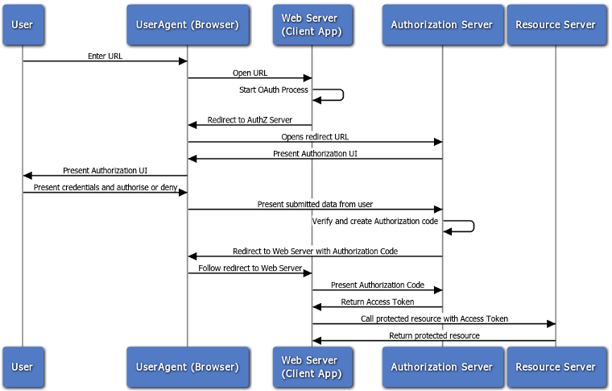
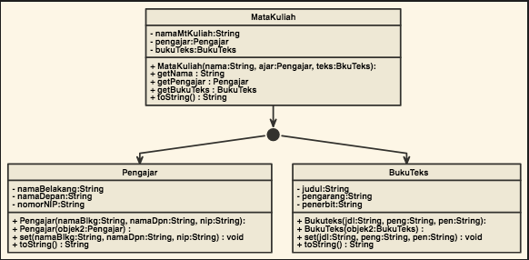
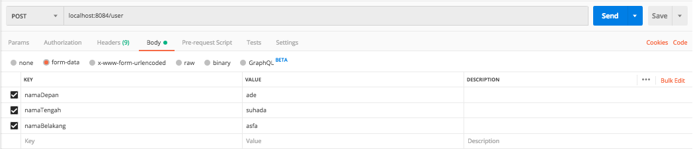
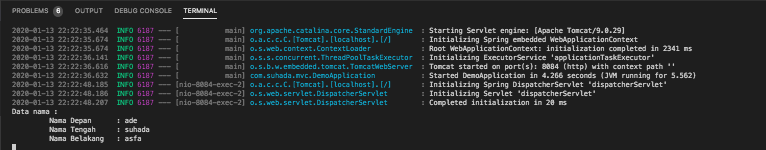
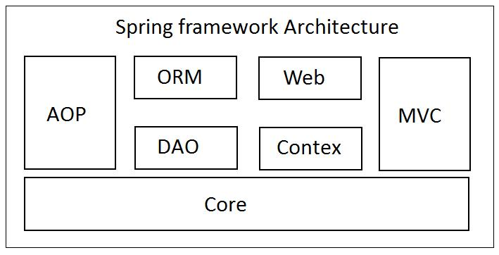
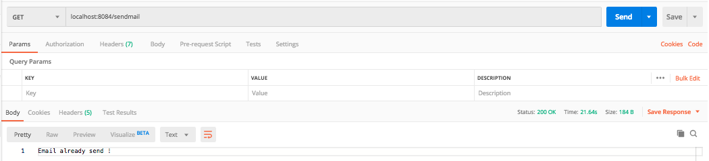

# NGODING JAVA 
tag line : **Ngoding java mulai hari ini.**

<p align="center">

</p>

## 1. Installasi/Compile/Error
```txt
1. Installasi
    1. install jdk 11 LTE [make sure punya akun oracle, kalo belum ada silahkan buat]
    2. cek : 
        > java --version 
        > output : 
            11.0.5 2019-10-15 LTS
            Java(TM) SE Runtime Environment 18.9 (build 11.0.5+10-LTS)
            Java HotSpot(TM) 64-Bit Server VM 18.9 (build 11.0.5+10-LTS, mixed mode)
    
    3. install intellij IDEA

    atau dapat menggunakan extension pada VSCode

2. Cara Compile
    1. java nama_file.java
    --> atau
    2. javac DemoPersegiPanjang.java
    3. java DemoPersegiPanjang
    --> atau
    1. pada vscode jalankan Command + shift + D
    2. pilih run with java

3. Error 
    1. `Error: Could not find or load main class`
    2. solusi --> [link](https://stackoverflow.com/questions/18093928/what-does-could-not-find-or-load-main-class-mean)
    3. pastikan berada pada path yang benar
```

## 2. #100DaysOfCode
[#100DayOfCode](java-data-structure/readme.md)

## 3. Android
[Implementation of java to android](#)

## 4. Springboot
[next level of java with Springboot](java-springboot/readme.md)


## 4. Sumber belajar
- [tutorialspoint](https://www.tutorialspoint.com/java/)
- [Spring framework](https://www.logicbig.com/tutorials/spring-framework.html)


# #100DaysOfCode
# Day 1 #100DaysOfCode 31-12-2019

hari ini mempelajari pemrograman meliputi :
```txt
tata cara penggunaan array, list dengan object yang terdiri dari multiple variable. Numbers pada java terdapat banyak API dimana kita bisa merubah dari satu tipe data ke tipe data lainnya. sebagai contoh kita bisa merubah dari tipe data integer ke tipe data byte, float, double dan long dan short. cara menggunakan regex atau regular expression untuk menyeleksi suatau variable string dengan parameter value tertentu. perulangan pada java terdiri dari 3 jenis yaitu for loop, while loop dan do-while loop, sedangkan untuk fileio kita bisa manipulasi input dan output data, membuat directory, membaca list file dan directory yang terdapat pada suatu directory, kita bisa membaca input keyboard.
```
## Object
```txt
object --> mempunyai tugas/fungsi/method 
object --> komponen software yang disimpan dalam memory yang memiliki tugas spesifik. ibject diciptakan oleh sebuah kelas yang memuat kode yang menjelaskan object tsb.
```

## Kelas
```txt
kelas --> dimana object berasal
kelas --> mendefinisikan object dengan tipe data tertentu
```

## Analogi
```txt
Sebuah mobil terdiri dari banayak komponen seperti ban, pedal rem, stir, mesin, spedometer dan yang lainnya, sehingga mobil disusun dari banyak komponen yang bekerja secara bersama-sama sesuai dengan fungsinya.
kita dapat menganalogikan bahwa komponen dari mobil tersebut sebagai method dari sebuah object dari sebuah class mobil yang mendefnisikan object-object tersebut.
```


## Variable Primitif versus Object
```txt
Variable primitif --> deklarasi suatu variabel dengan tipe data tertentu seperti : byte, short, int, long, char, float, double dan boolean
Object --> deklarasi object class

You can use these Format Specifiers for different data types
* %c or %C Display characters
* %d Displays a decimal (base 10 ) integer
* %e or %E Display a floating point number in exponential notation
* %f Display a floating point value in decimal format
* %s or %S Display Strings
* %b or %B Display boolean values
* %g (%G) float or double use %f or %e as required
* %o int unsigned octal value
* %p pointer address stored in pointer
* %s array of char sequence of characters or String
* %u int unsigned decimal
* %x (%X) int unsigned hex value
* %% Display a % sign

You can use whitespace characters which are
* space ( ' ' )
* tab ( '\t' )
* carriage return ( '\r' )
* newline ( '\n' )
* ormfeed ( '\f' )
``` 


# Day 2 #100DaysOfCode 01-01-2020
## Kontruktor
```txt
KONSEP : konstruktor secara otomatis akan dipanggil ketika sebuah object diciptakan.
dikatakan kontruktor karena konstruktor membantu menciptakan atau mengkonstrukri sebuah object.
dalam pemrograman java, ketika konstruktor tidak diinisialisai, maka java akan secara otomatis membuat sebuah konstruktor [konstruktor default].
konstruktor default memuat  semua nilai bidang numeris menjadi 0 dan memuat semua bidang boolean dalam kondisi false. 
```
bagaimana mendefinisikan konstruktor di java ?
* benar
    ```java
    public class name_class
    {
        public name_class(data_type1 name_var1, data_typen name_varn)
        {

        }
    }
    ```
* salah
    ```java
     public class name_class
    {
        public void name_class(data_type1 name_var1, data_typen name_varn)
        {
            
        }
    }
    ```
* resume
    ```txt
    saat membuat konstruktor kta tidak perlu menggunakan void cukup dengan public name_class. 
    nama konstruktor sama persis dengan nama kelas.
    ```

1. Implementasi Konstruktor 1 [TeleponSeluler.java]
    ```txt
    implementasi program dilakukan oleh UjiteleponSeluler.java, impelemntasi konstruktor dilakuakn saat membuat object telp dengan melewatkan 3 parameter pada class teleponSeluler.
    TeleponSeluler telp = new TeleponSeluler(ujiMan, ujiMod, ujiHarga);
    ```
2. Implementasi Konstruktor 2 [Dadu.java]
    ```txt
    Pada program dadu.java, sebuah kontrukto dadu menerima masukan berupa nilai jumlah_sisi yang akan digunakn untuk mendefinisikan jumlah sisi yang digunakan oleh dadu.
    ```
## Melewatkan Objek sebagai Argumen
   ```txt
    KONSEP : ketika sebuah object dilewatkan sebagai sebuah argumen pada sbeuah methode, akibatnya alamat object tsb dilewatkan kepada variable parameter dari methode tsb.
    sehingga paramater itu mereferensi object.
    Implementasi untuk melewatkan suatu object class sebagai sebuah parameter seuatu method dapat dilihat pada ArgumenDadu.java

    ketika kita melewatkan object sebagai parameter suatu method, hasilnya parameter akan mereferensi objek dan method yang bersangkutan dapat memiliki akses terhadap objek tersebut.
   ```

* Cho-Han
    ```txt
    cho-han merupakan permainan judi tradisional jepamg. dimana pemain akan menebak jumlah dari 2 dadu yang dilemparkan yang ditutup mangkok terbalik. cho (genap) han (ganjil).
    terdiri dari 2 class yaitu dealer dan pemain dan ChoHan.java untuk iplementasi.

    UML Dealer :
    - nilaiDadu1 : int
    - nilaiDadu2 : int
    + Dealer()
    + lemparDadu() : void
    + getChoAtauHan() : String
    + getNilaiDadu1 : int
    + getNilaiDadu2 : int


    UML Pemain :
    - nama : String
    - tebakan : String
    - point : int
    + Pemain(namaPemain:String)
    + buatTebakan() : void
    + tambahPoin(poinBaru : int) : void
    + getNama() : String
    + getTebakan() : String
    + getPoin() : int

    ChoHan :
    - BABAK_MAKS : final int 5
    - namaPemain1 : String
    - namaPemain2 : String
    + hasilBabak(Dealer dealer, Pemain pemain1, Pemain pemain2) : void
    + periksaTebakan(Pemain pemain, Dealer dealer) : void
    + tampilPemain(Pemain pemain1, Pemain pemain2) : void

    ```


# Day 3 #100DaysOfCode 02-01-2020
* Implementasi ChoHan 
   ```txt
    ChoHan :
    - BABAK_MAKS : final int 5
    - namaPemain1 : String
    - namaPemain2 : String
    + hasilBabak(Dealer dealer, Pemain pemain1, Pemain pemain2) : void
    + periksaTebakan(Pemain pemain, Dealer dealer) : void
    + tampilPemain(Pemain pemain1, Pemain pemain2) : void

    -Implementasi
    terdapat 4 class yang terlibat, yaitu :
    1. class Dadu
    2. class Dealer
    3. class Pemain
    4. class ChoHan

    - Class Dadu merupakan kunci dari permain ini. Nilai keluaran dari 2 buah object dadu digunakan oleh Dealer/bandar untuk permainan ini.
    - Class Dealer merupakan bandar yang menggunakan class Dadu sebagai alat permainannya.
    - Class Pemain menentukan tebakan apakah Cho (genap) ataukah Han (ganjil).
    - Class ChoHan merupakan main program yang mengimplementasikan class Dealer dan class Pemain.

    Catatan :
    - method/fungsi pada class ChoHan di definisikan di luar main program scope.
    - java API yang digunakan :
      1. Random -> java.util.Random --> untuk generate nilai random.
      2. Scanner -> java.util.Scanner --> untuk memperoleh input nama user dari keyboard.
   ```

* Pembebanan Metode dan Konstruktor.
    ```txt
    KONSEP : 
    Dua atau lebih metode di dalam suatu kelas dapat memiliki nama yang sama sepanjang daftar parameternya berbeda. ini juga berlaku untuk konstruktor.
    ```
    - contoh sebuah kelas mempunyai dua metode yang sama.
        ```java
        public int tambah(int nil1, int nil2)
        {
            int jum = nil1 + nil2;
            return jum;
        }
        ```
        ```java
        public String tambah(String str1, String str2)
        {
            String gabungan = str1 + str2;
            return gabungan;
        }
        ```
    - Implementasi
        ```txt
        UML Kelas AkunBank
        - saldo : double
        + AkunBank()
        + AkunBank(saldoAwal : double)
        + AkunBank(str : String)
        + tabung(jumlah : double) : void
        + tabung(str : String) : void
        + tarik(jumlah : double) : void
        + tarik(str : String) : void
        + setSaldo(b : double) : void
        + setSaldo(str : String) : void
        + getSaldo() : double
        ```

* Compile Java dan output ditempatkan di Directory yang berbeda.
    ```txt
    misalkan sususan directory :
    /java
      /class
      /src
        /main.java
    
    main.java dicompile dengan cara :
    > cd java/src
    > javac -d ../class main.java

    hasil dari class main.java disimpan pada directory class, sehingga susunan directorynya menjadi :
    /java
      /class
        /main.class
      /src
        /main.java
    ```

* Inherritance
    - konsep 
        ```txt
        Inheritance atau warisan/pewarisan
        Inheritance dapat didefinisikan sebagai proses dimana suatu kelas dapat memperoleh property [metode dan bidang] dari pewarisnya atau parent class nya.
        dengan menggunakan Inheritance kita dapat mengelola informasi secara hirarki.
        ```
    - syntax
        ```java
        class Super
        {
            .....
            .....
        }
        class Sub extends Super
        {
            .....
            .....
        }
        ```
    - implementasi basic
        - super class
            ```java
            // file Calculation.java
            public class Calculation
            {
                int z;
                public void addition(int x, int y)
                {
                    z = x+y;
                    System.out.println("Hasil penjumlahan " + x +" dan " + y + " adalah " + z);
                }
                public void substraction(int x, int y)
                {
                    z = x - y;
                    System.out.println("Hasil pengurangan " + x + " dengan " + y + " adalah " + z);
                }
            }
            ```
        - sub class
            ```java
            // file My_Calculation.java
            public class My_Calculation extends Calculation
            {
                public void multiplication(int x, int y)
                {
                    z = x * y;
                    System.out.println("hasil perkaliam antara " + x + " dengan " + y + " adalah " + z);
                }
            }
            ```
        - main class
            ```java
            // file Inheritance.java
            public class Inheritance 
            {
                public static void main(String[] args)
                {
                    int x = 39;
                    int y = 9;
                    My_Calculation hitung = new My_Calculation();
                    hitung.addition(x, y);
                    hitung.substraction(x, y);
                    hitung.multiplication(x, y);
                }
            }
            ```
        - compile
            ```txt
            > javac -d ../class Inheritance.java
            > cd ../class
            > java Inheritance
            ```
        - output
            ```txt
            Hasil penjumlahan 39 dan 9 adalah 48
            Hasil pengurangan 39 dengan 9 adalah 30
            hasil perkaliam antara 39 dengan 9 adalah 351
            ```
        - kesimpulan
            ```txt
            Inheritance atau Pewarisan adalah layaknya orang tua mewariskan ke anaknya.
            class My_Calculation merupakan Inheritance dari class parent Calculation.
            sehingga class My_Calculation memiliki akses untuk method dan variable di class Parent.
            saat implementasi, walaupun class My_Calculation hanya memiliki method multiplication, 
            tetapi kita dapat mengakses class addition dan substraction yang merupakan method parent My_Calculation
            yaitu class Calculation.
            ```
    - Implementasi super keyword
        - konsep
            ```txt
            - kata kunci super sama hal nya dengan kata kunci this. 
            - digunakan untuk membedakan member/method dari super class dan sub class
            - digunakan untuk memanggil konstruktor super class dari subclass
            - digunakan di subclass inheritance
            ```
        - super class
            ```java
            // file Super_class.java
            public class Super_class
            {
                int num = 20;

                public void display()
                {
                    System.out.println("This is the display method of Super class");
                }
            }
            ```
        - sub class
            ```java
            // file Sub_class.java
            public class Sub_class extends Super_class
            {
                int num = 10;

                public void display()
                {
                    System.out.println("This is the display method of Sub class");
                }

                public void my_method()
                {
                    Sub_class sub = new Sub_class();
                    sub.display(); // method from subclass
                    super.display(); // method from super class
                    System.out.println("num of subclass : " + sub.num);
                    System.out.println("num of super class : " + super.num);
                }
            }
            ```
        - kesimpulan
            ```txt
            super digunakan untuk membedakan antara method super class dan subclass yang memiliki nama yang sama.
            dapat digunakan untuk memanggil konstruktor superclass
            apabila menggunakan super untuk memanggil konstruktor super class, maka konstruktor sub class akan terpengaruhi oleh konstruktor super class.
            perhatikan konstruktor pada contoh untuk super class dan sub class.
            ```
    - catatan
        1. single inheritance
            ```java
            // B -> A
            public class A
            {
                ....
            }
            public class B extends A 
            {
                .....
            }
            ```
        2. multi level inheritance
            ```java
            // C -> B -> A
            public class A
            {
                .....
            }
            public class B extends A
            {
                .....
            }
            public class C extends B
            {
                .....
            }
            ```
        3. hieararchical inheritance
            ```java
            // B -> A
            // C -> A
            public class A
            {
                .....
            }
            public class B extends A
            {
                ......
            }
            public class C extends A
            ```
        4. java not support multiple inheritance

* Overriding
    - konsep
        ```txt
        keuntungan overriding : subsclass dapat mengimplementasikan method-method pada super class.
        ```
    - Implemantasi
        ```txt
            pada class overiding.java, meskipun object d dalam tipe animal dan class dog. tapi class d dapat mengakses method move pada class Dog.
            selama nama method sublass sama dengan nama method pada super class.
        ```

* Polymhorphism
    - konsep
        ```txt
        polymhorphism : kemampuan sebuah objek menjadi berbagai bentuk. polymhorphism banyak digunakan pada OOP saat referensi class parent
        digunakan untuk mereferensi ke object sub class.
        ```
    - contoh
        ```java
        public interface Vegetarian();
        public class Animal();
        public class Deer extends Animal implements Vegetarian();

        Deer d = new Deer(); // deer
        Animal a = d; // animal
        Vegetarian v = d; // vegetarian
        Object o = d; // object
        ```
    - implementasi
        ```txt
        class Deer dapat dikatan sebagai polymhorphism karena memiliki banyak bentuk, diantaranya :
        - Deer IS-A Animal
        - Deer IS-A Vegetarian
        - Deer IS-A Deer
        - Deer IS-A Object
        ```
    - Contoh lebih lanjut.
        ```txt
        Kelas Employee
        - name : String
        - address : String
        - number : int
        + Employee (name : String, address : String, number : int)
        + mailCheck() : void
        + toString() : String
        + getName() : String
        + getAddress() : String
        + setAddress(address : String) : void
        + getNumber() : int

        Kelas Salary
        - salary : double
        + Salary(name : String, address : String, number : int, salary : double)
        + mailCheck() : void
        + getSalary() : double
        + setSalary(newsalary : double) 
        + computePay() : double
        ```
# Day 4 #100DaysOfCode 03-01-2020
- melanjutkan Polymhorphism dan kelas Employee
    ```txt
    sesuai dengan kaidah makna dari Polymhorphism yaitu method pada suatu class dapat memiliki banyak bentuk. 
    VirtualDemo.java merupakan contoh Polymhorphism dimana kita dapat merubah substansi dari method mailCheck() 
    sub class tanpa harus merubah method di parent class.
    ```
- Abstraction
    - konsep
        ```txt
        As per dictionary, abstraction is the quality of dealing with ideas rather than events. 
        For example, when you consider the case of e-mail, complex details such as what happens as soon as you send an e-mail, 
        the protocol your e-mail server uses are hidden from the user. 
        Therefore, to send an e-mail you just need to type the content, mention the address of the receiver, and click send.
        ```
    - syntax
        ```java
        public abstract class Employee
        {
            .....
        }
        ```
    - Implementasi
        ```txt
        kelas Employee
        - name : String
        - address : String
        - number : int
        + Employee(name : String, address : String, number : int) 
        + computePay() : double
        + mailCheck() : void
        + toString() : String
        + getName()  : String
        + getAddress() : String
        + setAddress(newAddress : String) : void
        + getNumber() : int

        kelas Salary
        - salary : double
        + Salary(name : String, address : String, number : int, salary : double)
        + mailCheck() : void
        + getSalary() : double
        + setSalary(double newSalary) : void
        + computePay() : double 
        ```
    - compile
        - AbstractDemo.java
            ```java
            public class AbstractDemo
            {
                public static void main(String[] args) 
                {
                    Employee e = new Employee("tobil", "jogja", 123);
                    e.mailCheck();    
                }
            }
            ```
        - error
            ```java
            AbstractDemo.java:5: error: Employee is abstract; cannot be instantiated
            Employee e = new Employee("tobil", "jogja", 123);
                        ^
            1 error
            ```
        -  karena
            ```txt
            untuk meng-implementasikan abstract class kita harus melakukan dengan cara yang concrete.
            ```
        - solusi --> AbstractDemo.java
            ```java
            public class AbstractDemo
            {
                public static void main(String[] args) 
                {
                    Salary gajih_suhada  = new Salary("suhada", "cileungsi", 321, 15000.0);
                    Employee pegawai_ade = new Salary("ade", "jogja", 123, 5000.0);

                    System.out.println("call mailcheck using salary reference --");
                    gajih_suhada.mailCheck();
                    System.out.println("\ncall mailcheck using employee reference --");
                    pegawai_ade.mailCheck();
                }
            }
            ```
        - output
            ```txt
            call mailcheck using salary reference --
            inside of mailcheck salary class
            Mailing check to suhada with salary 15000.0

            call mailcheck using employee reference --
            inside of mailcheck salary class
            Mailing check to ade with salary 5000.0
            ```
- encapsulation
    - konsep
        ```txt
        enkapsulasi merupakan fundamental ke-4 dari OOP. 3 lainnya adalah inheritance (pewarisan), polymhorphism (banyak bentuk) dan abstraction (makna).
        enkapsulasi menutupi akses variable pada suatu kelas yang hanya dapat diakses oleh method di dalam kelas yang bersangkutan.
        ```
    - implementasi
        ```txt
        kelas EncapTest
        - name : String
        - idNum : String
        - age : int
        + setName(String newName) : void
        + setIdNum(int newIdNum) : void
        + setAge(int newAge) : void
        + getName() : String
        + getIdNum() : int
        + getAge() : int
        ```
- Interface
    - konsep
        ```txt
        interface bersifat abtract sehingga kita tidak perlu menuliskan abstract pada interface.
        ```
    - implementasi
        ```txt
        Animal.java
        + Animal() : interface
        + eat() : void
        + travel() : void

        Mamalia.java
        + eat() : void
        + travel() : void
        + noOfLegs() : int

        IntarfaceDemo.java
        + main()
        ```
    - contoh
        ```java
        /* File name : NameOfInterface.java */
        import java.lang.*;
        // Any number of import statements

        public interface NameOfInterface 
        {
            // Any number of final, static fields
            // Any number of abstract method declarations\
        }
        ```
    - kesimpulan
        ```txt
        terdapat 2 fungsi dasar dari interface yaitu :
        1. create a common parent
        2. adds a data type to class
        ```
- Packages
    - konsep
        ```txt
        lebih baik menggunakan lowercase saat mendefinisikan packages.
        memudahkan dalam penempatan directory file java dan file .class hasil eksekusi program
        agar tertata dengan rapih.
        ```

    - cara compile :
        ```
        > javac -d . Animal.java
        > javac -d . Mamalia.java
        > javac -d . PackageDemo.java
        > java PackageDemo
        ```

# Day 5 #100DaysOfCode 04-01-2020
- Struktur Data - Java
    ```
    struktur data yang disediakan oleh utilitas java sangat bergguna dan memiliki cakupan yang sangat luas.
    data struktur ini terdiri dari interface dan class sebagai berikut :
    1. Enumeration
    2. BitSet
    3. Vector
    4. Stack
    5. Dictionary
    6. Hash Table
    7. Properies
    ```
- Enumeration
    - konsep
        ```
        antar muka enumerasi sebenarnya bukanlah data struktur, tapi sangat berguna bagi stuktur data.
        enumrasi mendefinisikan sebuah makna untuk mengambil elemen successive dari struktur data.

        sebagai contoh :
        enumerasi mendefinisikan sebuah method yang disebut dengan nextElement yang digunakan untuk mendapatkan
        element selanjutnya di dalam sebuah struktur data yang terdiri dari beragam element. 

        Enumeration interface mendefinisikan sebuah method dimana kita bisa meng enummerasi (mengambil satu pada suatu waktu) element pada kumpulan object. 
        ```
    - implementasi
        ```java
        import java.util.Vector;
        import java.util.Enumeration;

        public class Enum 
        {
            public void showData()
            {
                Enumeration days;
                Vector dayNames = new Vector();

                dayNames.add("Senin");
                dayNames.add("Selasa");
                dayNames.add("Rabu");
                dayNames.add("Kamis");
                dayNames.add("Jum'at");
                dayNames.add("Sabtu");
                dayNames.add("Minggu");

                days = dayNames.elements();

                while(days.hasMoreElements())
                {
                    System.out.println(days.nextElement());
                }
            }
        }
        ```
    - pembahasan :
        ```
        Enumeration memiliki 2 method utama yang dapat digunakan :
        - hasMoreElements() --> return true saat masih ada data yang bisa di esktrak, dan false saat data sudah di enumerasi semua.
        - nextElement() --> return the next object
        ```

- challenge
    - konsep
        ```
        given an array of integers and sn integer k. you need to find the total number of sub array whose sum equals to k.
        
        Time-O(n)
        Space-O(n)
        Input: arr = [3,7,2,1,20]
        k = 10
        ouput 2

        input arr = [0,0,0]
        k = 0
        output : 6

        UML
        Challenge()
        - data : int
        - k : int
        - total : int
        + getSum(data1 : int, data2 : int) : void
        + getTotal() : int
        + addTotal(newPoin : int) : void
        ```
    - belum selesai

# Day 6 #100DaysOfCode 05-01-2020
- Bitset
    - konsep
        ```
        BitSet : class bitset menyimpan tipe spesial dari array yang menyimpan nilai-nilai bit. nilai bitset dapat di increase sesuai kebutuhan.
        hal ini mirip dengan bit-bit vector.

        kontruktor :
        1. BitSet()
        2. BitSet(int Size)
        
        method (total ada 26 method) :
        1. void and(BitSet bitSet)
        ...
        26. void xor(BitSet bitSet)
        ```

# Day 7 #100DaysOfCode 06-01-2020
- Vector
    - konsep
    ```
    Vector : mengimplementasikan dynamic array. mirip dengan arrayList namun memiliki 2 perbedaan :
        - vector bersifat syncronous
        - vector berisi banyak metode lama yang bukan bagian dari framework collection.
    ```
    - implementasi
    ```txt
    Implementasi dapat dicheck pada file VectorData.java
    ```
- Stack
    - konsep
        ```txt
        Stack merupakan subclass dari vector yang menerapkan standar last-in. first-out [FIFO]
        stack hanya didefinisikan menggunakan defult konstruktor, yang membuat stack kosong. 
        stack memiliki semua methode yang didefinisikan oleh vector, dan beberapa penambahan milik stack.

        stack ini mirip dengan tumpukaan, dapat dianalogikan sebagai tumpukan baju, baju terakhir yang ditumpuk merupakan baju pertama yg bisa diambil.
        ```
    - implementasi
        ```txt
        bash-3.2$ java StackDataDemo 
        stack : []
        push(0)
        Stack: [0]
        push(7)
        Stack: [0, 7]
        push(14)
        Stack: [0, 7, 14]
        push(21)
        Stack: [0, 7, 14, 21]
        push(28)
        Stack: [0, 7, 14, 21, 28]
        push(35)
        Stack: [0, 7, 14, 21, 28, 35]
        push(42)
        Stack: [0, 7, 14, 21, 28, 35, 42]
        push(49)
        Stack: [0, 7, 14, 21, 28, 35, 42, 49]
        push(56)
        Stack: [0, 7, 14, 21, 28, 35, 42, 49, 56]
        push(63)
        Stack: [0, 7, 14, 21, 28, 35, 42, 49, 56, 63]
        pop --> 63
        Stack: [0, 7, 14, 21, 28, 35, 42, 49, 56]
        pop --> 56
        Stack: [0, 7, 14, 21, 28, 35, 42, 49]
        pop --> 49
        Stack: [0, 7, 14, 21, 28, 35, 42]
        pop --> 42
        Stack: [0, 7, 14, 21, 28, 35]
        pop --> 35
        Stack: [0, 7, 14, 21, 28]
        pop --> 28
        Stack: [0, 7, 14, 21]
        pop --> 21
        Stack: [0, 7, 14]
        pop --> 14
        Stack: [0, 7]
        pop --> 7
        Stack: [0]
        pop --> 0
        Stack: []
        pop --> Stack is empty
        ```
- Dictionary - Map
    - konsep
        ```txt
        Maps merupakan antarmuka antara kata kunci dengan value. valua dapat diperoleh dengan menggunakan kata kunci.
        ```
    - implementasi
        ```txt
        Map element : {suhada=12, key=54}
        get value of Map[suhada] : 12
        key : [suhada, key]
        ```
- HashTable
    - konsep
        ```txt
        Hashtable merupakan bagian asli dari java.util dan merupakan implementasi konkret ari sebuah dictionary.
        seperti hal nya Hash/Map, Hashtable menyimpan key dengan value.
        ```
    - implementasi
        ```txt
        Qadir : -99.9
        Mahnaz : 123.23
        Daisy : 345.43
        Aayan : 137.86
        Zahra : 3434.34

        new balance of zahra is 4434.34
        ```
- Properties
    - konsep
        ```
            properties merupakan subclass dari hashtable, hanya saja value dari properties adalah string.
        ```
    - implementasi
        ```
        Implementasi properties dapat dilihat pada file PropertiesDemo.java.
        key dan value pada properties bernilai string. penambahan key dan value dilakukan menggunakan syntax : put
        
        Properties capitals = new Properties();
        capitals.put("Ade", "Bantul");
        capitals.put("Suhada", "Congcat");
        capitals.put("Frika", "Cileungsi");
        capitals.put("Atrika", "Kubang");

        keys dari properties diperoleh menggunakan kata kunci keySet() dan disimpan dalam tipe data set.

        output :
        the Capital of Ade is Bantul
        the Capital of Atrika is Kubang
        the Capital of Suhada is Congcat
        the Capital of Frika is Cileungsi
        ```

# Day 8 #100DaysOfCode 07-01-2020
- Collection
    - konsep
        ```
        1. framework collection di java memberikan akses kepada programmer untuk pre-package struktur data sebaik dengan algoritmanya untuk memanipulasi data.
        2. sebuah collection merupakan sebuah preferensi yang dapat menyimpan object lain. antarmuka colection mendeklasikan sebuah operasi yang dapat bekerja pada setiap tipe collection.
        3. class dan interface dari collection framework berada di package java.utl.*.
        ```

- SpringBoot Java Implementation
    - rest-service
        - konsep
            ```
            restfull : user mengakses endpoint yang berjalan sesui dengan method yang digunakan
            GET, POST, etc.
            ```
        - persiapan
            ```
            generate project menggunakan : shift + ⌘ [command] + P
            > Spring Inititalizr: Generate a maven project
            > ikuti petunjuk selanjutnya dari input yang diinginkan
            ```
        - membuat Greeting.java
        - membuat controller GrretingController.java
        - modify port dengan mengedit file application.properties --> server.port=9090
        - tambahkan extension SPRING-BOOT DASHBOARD
        - open : localhost:9090/greeting atau localhost:9090/greeting?name=Suhada
        - [link](https://spring.io/guides/gs/rest-service/)
        - build execution file : 
            ```
            grandle : ./grandle bootRun atau membuat menjadi file jar ./grandle build
            kemudian di running : java -jar build/libs/gs-rest-service-0.1.0.jar

            maven : ./mvnw spring-boot:run atau membuat jd file jar dengan ./mvnw clean package
            kemudian running : java -jar target/gs-rest-service-0.1.0.jar
            ```
        - implementasi : pada java-Springboot/suhada
        - Pembahsan
            ```
            return yang ditampilkan oleh browser saat memanggil endpoint adalah get dari class yang bersangkutan.
            saat memanggil endpoint "/" return dari browser adalah : {"id":23,"pesan":" Man Jadda wajada"}
            saat memanggil enspoint "/greeting" return yang dihasilkan adalah ; {"id":24,"content":"Hello,  world"} 
            ```


# Day 9 #100DaysOfCode 08-01-2020   
- Bab 2. Lanjut : Objek dan Kelas
    - konsep
        ```
        2.1 anggota kelas statis
            anggota kelas statis adalah milik dari kelas, bukan objek yang diinstasiasi dari kelas.
        ```
    - implementasi bidang statis : file Tercacahkan.java
    - pembahasan :
        ```
            meskipun yang memanggil getCacahObjek dari tch yang merupakan objeck pertama, nilai cacah akan 
            return banyaknya objek yang sudah diciptakan.
        ```
    - implementasi method statis : file Metrik.java dan MetrikDemo.java
    - pembahasan :
        ```
        metode statis sangat cocok untuk banyak pekerjaan karena dapat dipanggil langsung dari kelas saat diperlukan.
        metode statis digunakan untuk melukan operas-operasi data tanpa harus menyimpan data.

        satu-satunya kekurangan : tidak dapat digunakan pada anggota tak statis.

        ```

- Spring oauth2
    - flow diagram based on oracle
    <p align="center">
    
    </p>

    - konsep
        ```
        ketika kita menggunakan OAuth2, maka kita seharusnya menggunakan 2 server, yaitu yang satu bertugas sebagai authorization server, dimana server ini yang akan memberikan hak akses kepada apilkasi pihak ketiga. 
        Sedangkan server yang satu nya lagi sebagai resource server atau sebagai penyedia API.
        artinya ada 2 endpoint yang disediakan.
        ```
        [Sumber](https://rizkimufrizal.github.io/belajar-oauth2/)
    - implementasi [blm mulai implementasi]


# Day 10 #100DaysOfCode 09-01-2020
- nilai kembalian objecl dari sebuah method
    - konsep
        ```
        membuat sebuah method yang memiliki nilai kembalian object.
        ```
    - implementasi
        ```
        implementasi dilakukan pada file objekDemo.java
        nilai kembalian dari method getTercacahkan adalah objek Tercacahkan. 
        sehingga ketika diulang 10 kali, akan ada 10 objek yang dibuat menggunakan method tsb.
        ```
- toString()
    - konsep
        ```
        kebanyakan program menggunakan method toString yang secara implisit dipanggil pada kondisi tertentu.
        umumnya, method ini digunakan untuk merepresentasikan status dari sebuah objek.
        pada dasarnya, kita tidak perlu seacar explisit memanggil method toString().
        ```
    - implementasi
        ```
        file Saham.java dengan implementasi sahamDemo.java
        secara otomatis ketika objek saham sudah diciptakan, maka saat kita println objek tsb, method toString() akan dipanggil.
        ```
- equals
    - konsep
        ```
        objek yang sama dapat dibandingkan dengan menggunakan equals.
        contoh objek1 dan objek2 adalah objek yang sama, dapat di cek menggunakan 
        if(objek1.equals(objek2))
        {
            // true
        }

        akan tetapi, objek1 dan objek2 akan sama jika dilakukan penyalinan dengan benar.
        objek1 = objek2 --> salah

        untuk mengatasi hal ini dapat dilakukan dengan membuat method untuk menyalin objek ataupun dengan konstruktor yang melewatkan objek.
        ```
    - implementasi
        ```
        implementasi dapat dilihat pada file Saham.java
        ```
- agregasi
    - konsep
    ```
    agregasi terjadi ketika sebuah objek kelas merupakan bidang dari kelas lain.

    terkadang kita perlu membuat objek dari objek-objek lain. analoginya sama seperti ita membuat rumah.
    saat membuat rumah kita memerlukan objek pintu, onjek jendela, onjek lantai dan yang lainnya sehingga membentuk objek rumah.
    ```
    - implementasi
    ```
    implementasi agregasi dengan membuat objek matakuliah yang terdiri dari objek bukuText dan objek pengajar.
    ```

# Day 11 #100DaysOfCode 10-01-2020
- melanjutkan agregasi
    - implementasi
        ```
        implementasi dilakukan dengan membuat diagram uml terlebih dahulu, untuk memudahkan visualisasi saat membuat code program.
        ```

        ```nomnoml
 
        [<abstract>MataKuliah|
        - namaMtKuliah:String
        - pengajar:Pengajar
        - bukuTeks:BukuTeks|
        + MataKuliah(nama:String, ajar:Pengajar, teks:BkuTeks):
        + getNama : String
        + getPengajar : Pengajar
        + getBukuTeks : BukuTeks
        + toString() : String
        ] 
        

        
        [<abstract>Pengajar|
        - namaBelakang:String
        - namaDepan:String
        - nomorNIP:String|
        + Pengajar(namaBlkg:String, namaDpn:String, nip:String):
        + Pengajar(objek2:Pengajar) :
        + set(namaBlkg:String, namaDpn:String, nip:String) : void
        + toString() : String
        ] 

       
        [<abstract>BukuTeks|
        - judul:String
        - pengarang:String
        - penerbit:String|
        + Bukuteks(jdl:String, peng:String, pen:String):
        + BukuTeks(objek2:BukuTeks) :
        + set(jdl:String, peng:String, pen:String) : void
        + toString() : String
        ]

        [<start>st]
        
        [MataKuliah] --> [st]
        [st] --> [Pengajar]
        [st] --> [BukuTeks]
        ```
       <p align="center">
        
        </p>

# Day 12 #100DaysOfCode 11-01-2020
- Implementasi Agregasi
    ```
    implementasi terhadap source code dilakukan berdasarkan diagram UML.
    berdasarkan diagram UML, tedapat 3 class file java yaitu :
    1. Pengajar
    2. BukuTeks
    3. MataKuliah
    4. MataKuliahDemo

    agrerasi dapat dilihat bahwa objek BukuTeks dan Objek Pengajar digunakn untuk membentuk objek MataKuliah.
    ```

# Day 13 #100DaysOfCode 12-01-2020
- hindari penggunaan referesnsi *null* 
    - konsep
        ```
        secara default sebuah variable referensi yang merupakan bidang objek yang diinisialisasi dengan nilai null.
        hal ini mengindikasikan bahwa variable tersebut tidak mereferensi objek apapun.
        sebagai contoh : sebuah referensi null tidak dapat dipakai untuk memanggil methode. jika kita memaksakan untuk melakukan operasi dengan referensi null, maka program akan berhenti.
        ```
    - implementasi
        ```
        - NamaLengkap.java
          mengolah data nama lengkap untuk digunakan oleh objek.

        - NamaLengkapDemo.java
          apabila getPanjang_null() dipanggil saat atribut class nama lengkap belum didefinsikan alamat memorynya, maka program akan berhenti alias atribut tersbut masih dalam kondisi null.
        ```

# Day 14 #100DaysOfCode 13-01-2020
- Springboot MVC basic
    - konsep
        ```
        MVC atau Model View Controller biasa digunkan untuk membangun web.
        - Model
            biasanya digunakan untuk menyimpan/mengakses database. semua hal yang berkaitan dengan database dilakuakn oleh model.
        - View 
            biasanya digunakan sebagai tampilan dengan client. pada spring disimpan ada directory resource/static untuk file html, dan untuk file js dan css disimpan pada directory resources/templates
        - Controller
            biasanya digunakan sebagai pengendali request restfull api dari user. mengatur antaa model dan views.
        ```
    - Implementasi
        ```
        -mvc spring project basic
        pada folder /java-Springboot/mvc saya membuat project untuk mvc menggunakan spring.
        saya menambahkan  controller/HomeController.java pada java.com.suhada.mvc. 
        Homecontroller bertugas sebagai controller dan memberikan nilai return berupa halaman html.
        halaman html dibuat pada directory /resources/templates/home.html. sedangkan untuk file css/js/image
        dapat dibuat pada directory /resources/static.

        - menambahkan routing untuk user
        /user --> GET tidak memberikan nilai kembalian ke user
        /user --> POST dengan melewatkan parameter name depan, tengah dan belakang, kemudian menampilkan data tersbut pada condole.
        ```
    
    - postman request
        <p align="center">
        
        </p>
    - view from platform
        <p align="center">
        
        </p>


# Day 15 #100DaysOfCode 14-01-2020
- MVC bagian 2
    - challenge
        ```
        melakukan pencarian file berdasarkan inquiry user menggunakan api.
        - membuat List<String> Nama
        - menerima input user berupa nama dan memberikan return ? true : false

        catatan penting, cara mendefinisikan List : 
        private List<String> listName = new ArrayList<String>();
        ```
    - implementasi
        ```
        implementasi pencarian berhasil dilakukan menggunakan class User, 
        tapi ketika menggunakan class pada model masih terjadi error.

        error :
        Error resolving template [namaUser], template might not exist or might not be accessible by any of the configured Template Resolvers

        belum menemukan solusi, sehingga untuk sementara data model dilakukan oleh controller.
        ```

# Day 16 #100DaysOfCode 15-01-2020
- Generic
    - konsep 
        ```
        It would be nice if we could write a single sort method that could sort the elements in an Integer array, a String array, or an array of any type that supports ordering.

        Java Generic methods and generic classes enable programmers to specify, with a single method declaration, a set of related methods, or with a single class declaration, a set of related types, respectively.

        Generics also provide compile-time type safety that allows programmers to catch invalid types at compile time.

        Using Java Generic concept, we might write a generic method for sorting an array of objects, then invoke the generic method with Integer arrays, Double arrays, String arrays and so on, to sort the array elements.
        ```

    - implementasi
        ```
        generic implementasi melibatkan methd genericm=, and class generic.
        implementasi dilakukan untuk file :
        GenericMethodTest.java
        MaximumTest.java

        Generic Classes
        A generic class declaration looks like a non-generic class declaration, except that the class name is followed by a type parameter section.
        As with generic methods, the type parameter section of a generic class can have one or more type parameters separated by commas. These classes are known as parameterized classes or parameterized types because they accept one or more parameters.
        Box.java

        ```
        ```java
        /**
         * file GenericMethodTest.java 
         */
         
        public class GenericMethodTest
        {
            /**
            * generic method printArray
            * @param <E>
            * @param inputArray
            */
            public static <E> void printArray( E[] inputArray)
            {
                /**
                * display array element
                */
                for(E element : inputArray)
                {
                    System.out.printf("%s ", element);
                }
                System.out.println();
            }

            public static void main(String[] args) {
                /**
                * create arrays of Ineteger, Double and Char
                */
                Integer[] intArray = {1, 2, 3, 4, 5};
                Double[] doubleArray = {1.1, 2.2, 3.3, 4.4, 5.5};
                Character[] charArray = {'H', 'E', 'L', 'L', 'O'};

                /**
                * pass integer array
                */
                System.out.println("array intArray contains : ");
                printArray(intArray);
                System.out.println();

                /**
                * pass double array
                */
                System.out.println("array double contains : ");
                printArray(doubleArray);
                System.out.println();

                /**
                * pass charAray
                */
                System.out.println("array char contains : ");
                printArray(charArray);
                System.out.println();
            }
        }
        ```
        
        ```java
            /**
             * file Box.java
             */ 
            public class Box<T>
            {
                private T t;
                public void add(T t)
                {
                    this.t = t;
                }

                public T get()
                {
                    return t;
                }

                public static void main(String[] args) 
                {
                    Box<Integer> integerBox = new Box<Integer>();
                    Box<String> stringBox = new Box<String>();
                    
                    integerBox.add(10);
                    stringBox.add("man jadda wa jada");

                    System.out.println("Integer valud : " + integerBox.get());
                    System.out.println("String value : " + stringBox.get());
                }
            }
            ```
    - pembahasan
        ```
        generic dapat kita gunakan untuk method dan class yg bisa kita adjust tipe data yang akan kita gunakan, sebagaimana dapat dilihat pada file Box.java, GenericMethodTest.java dan MaximumTest.java
        ```

# Day 17 #100DaysOfCode 16-01-2020
- Getting Started Spring framework for beginner
    ```
    Spring framework dibangun oleh Rod Johson dan dijelaskan dalam bukunya yang berjudul “Expert One-on-One: J2EE Design and Development”.
    framework spring menyediakan 7 module yang dapat digunakan oleh developer. 
    developer dapat menggunakan 1 atau lebih module spring sesuai kebutuhan developer.
    ```
    - understanding Core
        
        <p align="center">
        
        </p>

        - Core Container
            ```
            Merupakan inti dari spring framework dan semua module lainnya dibangun diatas module ini. core container menyediakan
            fitur injeksi juga diketahui sebagai control inversi (inversion of control). module ini terdiri dari beanFactory 
            (sebuah implementasi pola factory) yang membuat dan mengatur siklus file dari berbagai objek aplikasi (dikenal sebagai bean).
            dikonfigurasi dalam file spring bean.
            ```

        - Application Context
            ```
            module ini menyediakan berbagai enterprise level service internasional, scheduling (penjadwadwalan),akses JNDI, email dll. 
            ```

        - AOP
            ```
            module ini membantu untuk implementasi berbagai cross cutting concern pada aplikasi seperti logging, menagement transaksi dan yang lainnya.
            bagian ini dipisahkan dari code aplikasi dan dan di injeksi ke berbagai titik potong melalui file konfigurasi.
            ```

        - Spring Web
            ```
            framework spring membantu dalam pengembangan web. module ini dibangun diatas conetxt module aplikasi dan menyediakan fitur berorientasi web.
            ```

        - Spring MVC
            ```
            framework spring MVC dibangun di atas spring module web dan membantu pengembangan web dalam pola design MVC.
            ```

        - Spring DAO
            ```
            Hampir semua aplikasi bisnis membutuhkan untuk berinteraksi dengan database. module Spring DAO membantu memudahkan dalam berinteraksi dengan database
            dengan menyediakan abstraksi dari tugas-tugas level rendah dari JDBC seperti membuat koneksi dengan database, merelese database, dan sebagainya.
            ```

        - Spring ORM
            ```
            Memiliki berbagai mapping hubungan-objek popular seperti hibernate, iBatis, JPA etc. 
            module Spring ORM membantu untuk berintegrasi dengan fungsi-fungsi tsb.
            ```

# Day 18 #100DaysOfCode 17-01-2020
- Java Serializations
    - konsep
        ```
        Java menyediakan sebuah mekanimse yang dikenal dengan serialisasi objek dimana sebuah objek dapat direpresentasikan sebagai sebuah urutan bytes yang terdiri
        dari data objek sebagai sebuah informasi mengenai tipe objek dan tipe data yang disimpan di dalam objek tsb.
        
        setelah serialisasi objek dituliskan dalam sebuah file, kita dapat membaca file tsb dan melakukan deserialisasi dimana tipe informasi dan tipe bytes yang
        merepresentasikan objek tsb dapat digunakan kembali untuk membuat objek di dalam memoery.

        yang lebih mengesankan, JVM melakukan hal tersebut secara independen/mandiri artinya sebuah objek dapat i serialisasi pada sebuah platform dan di deserialisasi pada platform lainnya.

        ```
    - implementasi
        ```
        path : dev-java/java-data-structure/Java-advanced/
        - Employee.java
        - SerializeDemo.java
        - DesrializeDemo.java
        ```
        ```java
        // file Employee.java
        public class Employee implements java.io.Serializable
        {
            public String name;
            public String address;
            public transient int SSN;
            public int number;

            public void mailCheck()
            {
                System.out.println("Mailing to "+ name + " " + address);
            }
        }
        ```

        ```java
        // file SerializeDemo.java
        import java.io.FileOutputStream;
        import java.io.IOException;
        import java.io.ObjectOutputStream;

        public class SerializeDemo
        {
            public static void main(String[] args) 
            {
                Employee e = new Employee();
                e.name = "Ade Suhada";
                e.address = " Bogor, Jawa Barat";    
                e.SSN = 063063456;
                e.number = 1;

                try
                {
                    FileOutputStream fileOut = new FileOutputStream("employee.ser");
                    ObjectOutputStream out = new ObjectOutputStream(fileOut);
                    out.writeObject(e);
                    out.close();
                    fileOut.close();
                    System.out.println("data serialisasi disimpan pada employee.ser");     
                } catch (IOException i)
                {
                    i.printStackTrace();
                }
            }
        }
        ```

        ```java
        // file DeserializeDemo
        import java.io.*;

        public class DeserializeDemo
        {
            public static void main(String[] args) 
            {
                Employee e = null;
                
                try
                {
                    FileInputStream filein = new FileInputStream("employee.ser");
                    ObjectInputStream in = new ObjectInputStream(filein);
                    e = (Employee) in.readObject();
                    in.close();
                    filein.close();
                } catch (IOException i)
                {
                    i.printStackTrace();
                    return;
                } catch (ClassNotFoundException c)
                {
                    System.out.println("Class employee tidak ditemukan");
                    c.printStackTrace();
                    return;
                }

                System.out.println("Deseriliasisasi demo pada objek class employee");
                System.out.println("Nama \t : " + e.name);
                System.out.println("Alamat \t : " + e.address);
                System.out.println("SSN \t : " + e.SSN);
                System.out.println("Nomor \t : " + e.number);
            }
        }
        ```
    - pembahasan
        ```
        compile dan jalankan :
        > javac SerializeDemo.java
        > java SerializeDemo

        Employee e = new Employee();
        e.name = "Ade Suhada";
        e.address = " Bogor, Jawa Barat";    
        e.SSN = 063063456;
        e.number = 1;

        data yang diisi berupa data diatas, transient membuat data tidak dituliskan menjadi serial data yang dituliskan ke dalam file.
        sehingga ketika kita jalankan file DeserializeDemo.java, hasil untuk SSN akan bernilai 0, sedangkan value objek lainnya tetap sama.
        ```

# Day 19 #100DaysOfCode 18-01-2020
- Networking [TCP/UDP]
    - konsep
        ```
        maksud dari pemrograman jaringan bermakna untuk menulis program yang di eksekusi di berbagai macam perangkat(komputer), dimana setiap 
        perangkat saling terhubung satu sama lain menggunakan jaringan.

        Paket java.net dari J2SE API terdiri dari kumpulan kelas dan antar muka yang menyediakan detail komunikasi level rendah, sehingga memungkinkan
        kita untuk menulis program yang berfokus untuk menyelesaikan masalah dengan mudah.

        Paket java.net menyediakan dukungan untuk 2 jeniah protokol jaringan yang biasa digunakan :
            - TCP : Transmission Control Protocol, memungkinkan untuk berkomnunikasi antara 2 perangkat. 
                    TCP digunakan hampir di semua  protokol internet, yang mereferensi ke TCP/IP.
            - UDP : User Datagram Protocol, memungkinkan untuk mengirim paket-paket data antar aplikasi.

        Pemahaman yang bagus untuk kita pelajari meliputi :
            - Socket Programming : paling banyak digunakan dalam jaringan.
            - URL Processing : dijelaskan secara terpisah.

        Socket Programming
        Socket menyediakan sebuah komunikasi antara 2 komputer menggunakan TCP.
        TCP merupakan two-way protokol komunikasi yang artinya data stream dapat dikirim pada waktu yang bersamaan.
        ```
    - implementasi
        ```
        GreetingClient.java
        GreetingServer.java
        ```

# Day 20 #100DaysOfCode 19-01-2020
- Enumerasi
    - konsep
        ```
        Tipe data enumerasi terdiri dari nilai-nilai yang telah ditetapkan. kita dapat menggunakan tipe data ini untuk menciptakan variable, 
        yang hanya bisa merepresentasikan nilai-nilai yang ditetapkan untuk tipe data tsb.

        kadangkala, ada gunanya untuk menciptakan tipe data sendiri yang memiliki himpunan nilai spesifik. imsalnya, kita ingin menciptakan tipe data dengan nama hari, 
        dan nilai-nilai legal untuk tipe data itu adalah nama-nama hari dalam seminggu [senin-sealasa-rabu-kamis-jum'at-sabtu-minggu].

        source : buku
        ```
    - implementasi
        ```
        Hari.java
        EnumerasiDemo.java
        ```

# Day 21 #100DaysOfCode 20-01-2020
- Mengirim E-mail
    - konsep
        ```
        mengirim email menggunakan framework springboot.

        source : https://www.tutorialspoint.com/spring_boot/spring_boot_sending_email.htm
        ```
    - implementasi
        ```
        implementasi pada directory : 
        dev-java/java-Springboot/gmail
        ```

# Day 22 #100DaysOfCode 21-01-2020
- Mengirim E-mail part #2
    - konsep
        ```
        password yang digunakan merupakan password apps yang dapat digenerate melalui panduan link berikut.
        ```
        [link generate password app](https://support.google.com/accounts/answer/185833?p=InvalidSecondFactor)


# Day 23 #100DaysOfCode 22-01-2020
- Mengirim E-mail part #3
    - EmailController.java
        ``` java
        // file EmailController.java v1
        import org.springframework.web.bind.annotation.RestController;

        import java.io.IOException;
        import java.util.Properties;
        import javax.mail.Message;
        import javax.mail.MessagingException;
        import javax.mail.Multipart;
        import javax.mail.Session;
        import javax.mail.Transport;
        import javax.mail.internet.InternetAddress;
        import javax.mail.internet.MimeBodyPart;
        import javax.mail.internet.MimeMessage;
        import javax.mail.internet.MimeMultipart;

        import org.springframework.web.bind.annotation.RequestMapping;
        import org.springframework.web.bind.annotation.RequestMethod;


        @RestController
        public class EmailController
        {

            @RequestMapping(value="/sendmail", method=RequestMethod.GET)
            public String sendEmail() throws javax.mail.internet.AddressException, MessagingException, IOException
            {
                
                System.out.println("/sendmail");
                final String from = "yourmail@gmail.com";
                final String password = "xxx";
                final String to = "youra-destination@gmail.com";
                final String sub = "java mail";
                mailKind jenis_email = mailKind.FILE;
                final String msg = "This is second java message";
                sendmail(from, password, to, sub, msg, jenis_email);
                return "Email already send !";
            }


            private void sendmail(String from, String password, String to, String sub, String msg, mailKind jenis_email) throws javax.mail.internet.AddressException, MessagingException, IOException 
            {
            
                //Get properties object    
                Properties props = new Properties();    
                props.put("mail.smtp.host", "smtp.gmail.com");    
                props.put("mail.smtp.socketFactory.port", "465");    
                props.put("mail.smtp.socketFactory.class",    
                            "javax.net.ssl.SSLSocketFactory");    
                props.put("mail.smtp.auth", "true");    
                props.put("mail.smtp.port", "465");  

                //get Session   
                Session session = Session.getDefaultInstance(props,    
                new javax.mail.Authenticator() 
                {    
                    protected javax.mail.PasswordAuthentication getPasswordAuthentication() 
                    {    
                        return new javax.mail.PasswordAuthentication(from,password);  
                    }    
                });    

                //compose message    
                try {    
                MimeMessage message = new MimeMessage(session);    
                message.addRecipient(Message.RecipientType.TO,new InternetAddress(to));    
                message.setSubject(sub);   
                
                // select based on kind of mail
                    switch (jenis_email) {
                        case TEXT:
                            System.out.println(mailKind.TEXT);
                            message.setText(msg); 
                            break;
                        case FILE:
                            Multipart multipart = new MimeMultipart();
                            MimeBodyPart attachPart = new MimeBodyPart();
                            attachPart.attachFile("./HELP.md");
                            multipart.addBodyPart(attachPart);
                            message.setContent(multipart);
                            break;
                        default:
                            break;
                    }
                    

                //send message  
                Transport.send(message);    
                System.out.println("message sent successfully");    
                } catch (MessagingException e) {throw new RuntimeException(e);}       
            }
        }
        ```
    - konseppackage com.suhada.gmail;


        ```
        1. pastikan menggunakan password app
        2. pastikan koneksi internet dapat terhubung dengan baik
        3. lakukan percobaan
        ```
    - hasil
        - test with end point
            <p align="center">
            
            </p>
        - hasil
            <p align="center">
            
            </p>

- Challenge kirim email ke perushaan-perushaan IT di asia tenggara.
    - konsep
        ```
        konsepnya seperti : https://www.youtube.com/watch?v=e8zx0-eoDLE
        mengirim lebih ke 50.000 perusahaan. great.

        tahapanannya :
        1. cari website nya
            -> https://clutch.co/app-developers/se-asia
            -> https://clutch.co/id/top-service-providers?page=n
        2. scrapping data email perusahaan
        3. kirim email
        ```
    
    - package
        - install maven : Simply put, Maven is a command-line tool for building Java applications
            - brew install maven
            ```
            Apache Maven 3.6.3 (cecedd343002696d0abb50b32b541b8a6ba2883f)
            Maven home: /usr/local/Cellar/maven/3.6.3/libexec
            Java version: 11.0.5, vendor: Oracle Corporation, runtime: /Library/Java/JavaVirtualMachines/jdk-11.0.5.jdk/Contents/Home
            Default locale: en_ID, platform encoding: UTF-8
            OS name: "mac os x", version: "10.13.6", arch: "x86_64", family: "mac"
            ```
    - project
        - [scrapping](../Java-challenge/scrapping/readme.md)

# Day 24 #100DaysOfCode 23-01-2020
- Day of execution mail
    - beginning of email
        ```
        - social
        - marketing
        - hello
        - contact
        - support
        - info
        - press
        - media
        - team
        - sales
        - enquiries
        - help
        - business
        - service
        - career
        - community
        - opportunities
        ```
    - subject mail
        ```
        Hey Team - You are doing great, I really love what you are doing!
        ```
    - message
        ```
        Hi, 
        My name is Suhada, I am junior sotfware engineer at start up in Yogyakarta, Indonesia. 

        I just wanted to say that i'm huge fan of your company and interested with your company. 
        I love your products and your services, your team doing great work, I would love to learn more about your company.

        I was also wondering if you have any sample product or any company's swag could you send my way -
        I'd love to try it, and would appreciate anything you could send me.

        Thank you so much and have a great Day.

        Sincerely yours, 
        Suhada


        ---------------
        alamat
        ---------------
        ```
    - mail total : 202.113 

- Mengatur Properties pada project maven
    - konsep
        ```
        menyimpan nilai-nilai variabel pada sebuah properties, sehingga ketika di upload ke github, kita dapat menyembunyikan informasi tersebut.
        info yang dimaksud adalah : alamat email dan password, serta info2 penting lainnya.
        selanjutnya agar tidak diupload ke github, kita menambahkan item format data tersebut pada gitignore.
        ```

# Day 25 #100DaysOfCode 24-01-2020
- send mail [completed]
- java gui part #1
    - introduksi
        ```
        GUI (Graphical User Interface) membuat antarmuka pengguna.
        Rancangan antarmuka pengguna.
        Component <-- Container <-- JComponent <-- AbstracButton <---- JButton
                                                |                  |-- JToggleButton <---- JCheckBox
                                                |-- JLabel                             |-- JRadioButton
                                                |-- JTextComponent <---- JTextArea
                                                |-- JComboBox        |-- JTextField <-- JPasswordField
                                                |-- JList
                                                |-- JScrollBar
                                                |-- JSlider
        ```
    - Button/Tombol
        ```
        Tombol merupakan suatu komponen yang memicu event aksi ketika diklik, Swing menyediakan tombol reguler, tombl toggle, tombol kotak periksa, dan tombol radio.
        fitur tsb didefinisikan di dalam javax.swing.AbstractButton.
        UjiIkonTombol.java
        --> ikon press akan muncul saat button ditekan, sedangkan ikon rollover akan muncul saat mouse berada diatas tombol.
        ```

- mailChecker
    - generate maven project
        ```
         mvn archetype:generate \
            -DgroupId=com.suhada.app \
            -DartifactId=mailChecker \
            -DarchetypeArtifactId=maven-archetype-quickstart \
            -DinteractiveMode=false
        ```
    - get API-KEY
        - [link](https://gamalogic.com/#api)

# Day 26 #100DaysOfCode 25-01-2020
- mail checker without API
    - konsep
        ```
        ```
     - implementasi
        ```
        iplementasi dilakukan pada path : /dev-java/dev-challenge/scrapping/mailChecker
        ```

- java JSON
    - generate maven project
        ```
        mvn archetype:generate \
            -DgroupId=com.suhada.app \
            -DartifactId=javaJson \
            -DarchetypeArtifactId=maven-archetype-quickstart \
            -DinteractiveMode=false
        ```
    - tambahkan dependensi berikut pada file pom.xml
        ```xml
            <!-- https://mvnrepository.com/artifact/com.googlecode.json-simple/json-simple -->
            <dependency>
                <groupId>com.googlecode.json-simple</groupId>
                <artifactId>json-simple</artifactId>
                <version>1.1.1</version>
            </dependency>
        ```
    - install dependency :`mvn install`
    - jika terjadi error, tambahkan properties berikut pada pom.xml
        ```xml
         <!-- menambahkan properties untuk solved error -->
        <properties>
            <maven.compiler.source>1.6</maven.compiler.source>
            <maven.compiler.target>1.6</maven.compiler.target>
            <java.version>1.8</java.version>
        </properties>
        ```
    - konsep
        ```
        konsepnya adalah melakukan validasi email menggunakan API mail checker.
        rsponse dari mail checker adalah berbentuk json.
        berdasarkan data json tersebut, kita harus bisa menemukan informasi yang dibutuhkan, yaitu apakah email yg kita maksd valid ataukah kita.

        tahapan :
        1. memperoleh akses API pada laman : https://gamalogic.com/#api
        2. parsing json
        ```
    - implementasi
        ```
        implementasi dilakukan pada project maven : /dev-java/dev-challenge/javaJson
        -> membaca email pada file .csv
        -> validasi setiap email
        -> write email yg valid dan yang tidak valid masing-masing pada file yangberbeda
        ```
    - pembahasan
        - obj1
            ```json
                {
                "gamalogic_emailid_vrfy": [
                    {
                    "do_you_mean": false,
                    "is_role": false,
                    "is_unknown": false,
                    "is_valid": true,
                    "is_syntax_valid": true,
                    "emailid": "mail@suhada.com",
                    "is_catchall": false,
                    "message": "Valid ID",
                    "resolved_time": 0.8651,
                    "is_disposable": false
                    }
                ]
                }
            ```
        - obj2
            ```json
            [
            {
                "do_you_mean": false,
                "is_role": false,
                "is_unknown": false,
                "is_valid": true,
                "is_syntax_valid": true,
                "emailid": "mail@suhada.com",
                "is_catchall": false,
                "message": "Valid ID",
                "resolved_time": 0.8651,
                "is_disposable": false
            }
            ]
            ```
        - obj3
            ```json
            {
                "do_you_mean": false,
                "is_role": false,
                "is_unknown": false,
                "is_valid": true,
                "is_syntax_valid": true,
                "emailid": "suhada@widyawicara.com",
                "is_catchall": false,
                "message": "Valid ID",
                "resolved_time": 0.8651,
                "is_disposable": false
            }
            ```
        - write file to email_valid.json
            ```json
            {
                "valid_mail" :
                [
                    {
                        "id": 1,
                        "mail" : "mail@mail.com"
                    },
                    {
                        "id": n,
                        "mail": "n@n.com"
                    }

                ]
            }
            ```

# Day 27 #100DaysOfCode 26-01-2020
- memisahkan email yang valid dengan yang tidak valid [waiiting list]
- membuat CV [completed]
- modifikasi .gitignore [link](https://stackoverflow.com/questions/1139762/ignore-files-that-have-already-been-committed-to-a-git-repository)
    - eidt .gitignore
    - `git rm -r --cached .`
    - `git add .`
    - `git commit -m ".gitignore is now working"`
    - `git push -u origin master`
    - To undo `git rm --cached filename`, use `git add filename`.

# Day 28 #100DaysOfCode 27-01-2020
- validate email with non API
    - facing error : `java.lang.ArrayIndexOutOfBoundsException: Index 1 out of bounds for length 1`
        - penyebabnya adalah : social@enterprise.affle.com --> memiliki 2 dot (.), sehingga arraynya lebih dr 1.

# Day 29 #100DaysOfCode 28-01-2020
- read json file with gmail project.
    - konsep
        ```
        semua data disimpan pada file .json yang sebelumnya disimpan pada file .csv, hal ini searah dengan mataeri sebelumnya dalam memanfaatkan file json.
        pada projects gmail, saya menambahkan file sendMultipleMail.java, file tersebut memanfaatkan file config.json yang saya buat untuk mengkonfigurasi email dan password
        beserta dengan subject dan message yang akan digunakan.
        ```

    - format config.json
        ```json
        {
            "emails_conf": [{
                    "email": "your email",
                    "password": "your password app"
                }
            ],
            "message_conf": [{
                    "id": 1,
                    "sub": "your subjects",
                    "msg": "your message"
                }
            
            ]
        }
        ```

# Day 30 #100DaysOfCode 29-01-2020
- Bean
    - konsep
    ```
    A bean is an object that is instantiated, assembled, and otherwise managed by a Spring IoC container. 
    These beans are created with the configuration metadata that you supply to the container, for example, in the form of XML definitions.

    @Autowired      --> This annotation tells the Spring container where to perform dependency injection
    @Configuration  --> used to tell the container that beans are defined
    @Bean           --> The methods which returns bean instances are annotated with @Bean, which is another directive for the container so that it will know what objects should be registered as beans.
    ```
    - implementasi --> /dev-java/java-Springboot/spring-bean

- getting started with java videos from youtube [link]()
- java classpath
    - set up compile : `javac BitSetData.java -d bin`
    - set up compile : `javac BitSetDemo.java -d bin`
    - run :
        1. -cp : `java -cp bin BitSetDemo`
        2. EXPORT : 
            * `export CLASSPATH=bin java BitSetDemo` 
            * `export CLASSPATH=bin` --> `java BitSetDemo`

- java jodatime manually
    - download joda time .jar [disini]()
    - buat directory `src`, `bin` dan `package`, copy .jar jodatime ke directory packages
    - compile : `javac -cp ./packages/joda-time-2.10.5.jar src/* -d bin/`
    - run : `java -cp ./packages/joda-time-2.10.5.jar:bin maven_basic.src.demoJodaTime`
    - tidak efektif karena pada project sebenarnya akan terdapat banyak file .jar

- maven buildtools
    - dependency management
    - generate : `mvn archetype:generate`
    - compile : `mvn package`
    - package
    - run : `java -cp target/suhada-1.0-SNAPSHOT.jar suhada.App`
    - Test

    - [cari lib maven](search.maven.org)

- kenapa menggunakan maven ?
    1. dependency management
    2. ada aturan baku untuk struktur folder
    3. portable : bisa digunakan di multi IDE dan multi platform

berbagai build tools di java :
1. Ant + Ivy
2. Maven
3. gradle


# Day 31 #100DaysOfCode 30-01-2020
- Challenge
    - membuat chart.js dengan data yang diambil dari database [not completed]
- Spring - Different ways of injecting dependencies
    - generate maven project
        ```
        mvn archetype:generate \
            -DgroupId=com.suhada.app \
            -DartifactId=spring_core \
            -DarchetypeArtifactId=maven-archetype-quickstart \
            -DinteractiveMode=false
        ```
    - [detail](./java-Springboot/spring_core/readme.md)

- Set-up Springboot JPA
    - create database
        - got error : karena MYSQL blm di running `ERROR 2002 (HY000): Can't connect to local MySQL server through socket '/tmp/mysql.sock' (2)`
        - solve : `mysql.server start`
        - `mysql -u root -p`
        - show database : `show databases`
        - delete database : `drop database nama_database`
        - `create database pelatihan;`
        - `create user 'pelatihanuser' identified by 'ThePassword';`
        - `grant all on pelatihan.* to 'pelatihanuser';`
    - setelah spring diajalankan, akan diperoleh hasil berikut :
        ```
        mysql> show tables;
        +---------------------+
        | Tables_in_pelatihan |
        +---------------------+
        | peserta             |
        +---------------------+
        1 row in set (0.00 sec)
        ```
        - `show create table peserta \G`

- resume java database mysql
    - `pom.xml` tambahkan dependency jpa
        ```xml
        <dependency>
			<groupId>org.springframework.boot</groupId>
			<artifactId>spring-boot-starter-data-jpa</artifactId>
		</dependency>
        ```
    - `pom.xml` tambahkan dependency mysql
        ```xml
        <dependency>
			<groupId>mysql</groupId>
			<artifactId>mysql-connector-java</artifactId>
			<scope>runtime</scope>
		</dependency>
        ```
    - `src/main/resources/application.properties` : konfigurasi koneksi database
        ```
        # spring.jpa.hibernate.ddl-auto=update
        # spring.datasource.url=jdbc:mysql://${MYSQL_HOST:localhost}:3306/pelatihan
        spring.datasource.url=jdbc:mysql://localhost:3306/pelatihan?useUnicode=true&useJDBCCompliantTimezoneShift=true&useLegacyDatetimeCode=false&serverTimezone=UTC
        spring.datasource.username=pelatihanuser
        spring.datasource.password=ThePassword

        spring.jpa.generate-ddl=true
        ```
    - Entitiy class dengan anotasi `@Entity`
        ```java
        package com.suhada.spring_jpa.entity;
        import javax.persistence.Column;
        import javax.persistence.Entity;
        import javax.persistence.Id;

        @Entity
        public class Peserta
        {
            @Id
            private String id;

            @Column(nullable = false)
            private String nama;

            @Column(nullable = false, unique = true)
            private String email;
        }
        ```
    - membuat user dan password untuk terhubung dengan database
        ```sql
        create database pelatihan;
        create user 'pelatihanuser' identified by 'ThePassword';
        grant all on pelatihan.* to 'pelatihanuser';
        ```
- JPA [Java Persistance API] Mapping
    - `@OneToMany`
    - `@ManyToOne`
    - `@ManiToMany`
    - melihat perubahan pembuatan table :
        ```sql
        mysql> show databases;
        +--------------------+
        | Database           |
        +--------------------+
        | information_schema |
        | mysql              |
        | pelatihan          |
        | performance_schema |
        | sys                |
        +--------------------+

        mysql> show tables;
        +---------------------+
        | Tables_in_pelatihan |
        +---------------------+
        | m_materi            |
        | peserta             |
        | peserta_pelatihan   |
        | sesi                |
        +---------------------+
        4 rows in set (0.01 sec)
                
        mysql> use pelatihan;
        Database changed

        mysql> show create table peserta \G
        *************************** 1. row ***************************
            Table: peserta
        Create Table: CREATE TABLE `peserta` (
        `id` varchar(255) NOT NULL,
        `email` varchar(255) NOT NULL,
        `nama` varchar(255) NOT NULL,
        `tanggal_lahir` date NOT NULL,
        PRIMARY KEY (`id`),
        UNIQUE KEY `UK_4pf6h2ver6d4igrrq6vvo4dbv` (`email`)
        ) ENGINE=InnoDB DEFAULT CHARSET=utf8mb4 COLLATE=utf8mb4_0900_ai_ci
        1 row in set (0.00 sec)


        mysql> show create table peserta_pelatihan \G
        *************************** 1. row ***************************
            Table: peserta_pelatihan
        Create Table: CREATE TABLE `peserta_pelatihan` (
        `id_sesi` varchar(255) NOT NULL,
        `id_peserta` varchar(255) NOT NULL,
        KEY `FKrqf99w12417r5aurhp7bc9qfm` (`id_peserta`),
        KEY `FKri78q6otiq6p470s5bc2efqc0` (`id_sesi`),
        CONSTRAINT `FKri78q6otiq6p470s5bc2efqc0` FOREIGN KEY (`id_sesi`) REFERENCES `sesi` (`id`),
        CONSTRAINT `FKrqf99w12417r5aurhp7bc9qfm` FOREIGN KEY (`id_peserta`) REFERENCES `peserta` (`id`)
        ) ENGINE=InnoDB DEFAULT CHARSET=utf8mb4 COLLATE=utf8mb4_0900_ai_ci
        1 row in set (0.00 sec)


        mysql> show create table sesi \G
        *************************** 1. row ***************************
            Table: sesi
        Create Table: CREATE TABLE `sesi` (
        `id` varchar(255) NOT NULL,
        `mulai` date DEFAULT NULL,
        `sampai` date DEFAULT NULL,
        `id_materi` varchar(255) NOT NULL,
        PRIMARY KEY (`id`),
        KEY `FK14wd3vhfwmi3pa8aayo38rgad` (`id_materi`),
        CONSTRAINT `FK14wd3vhfwmi3pa8aayo38rgad` FOREIGN KEY (`id_materi`) REFERENCES `m_materi` (`uuid`)
        ) ENGINE=InnoDB DEFAULT CHARSET=utf8mb4 COLLATE=utf8mb4_0900_ai_ci
        1 row in set (0.00 sec)
        ```

# Day 32 #100DaysOfCode 31-01-2020
- CRUD [Create, Read, Update, and Delete] dan Database Testing
    - membuat package baru DAO [Data Access Object]
    - java generator : [plugin java generator](https://marketplace.visualstudio.com/items?itemName=sohibe.java-generate-setters-getters)
    - pastikan untuk ID peserta sudah digenerate menggunakan UUID.
        ```java
        @Id @GeneratedValue(generator = "uuid")
        @GenericGenerator(name = "uuid", strategy = "uuid2")
        private String id;
        ```
    - output Test pada mysql
        ```sql
        mysql> use pelatihan; select * from peserta;
        Reading table information for completion of table and column names
        You can turn off this feature to get a quicker startup with -A

        Database changed
        +--------------------------------------+----------------------+-------------+---------------+
        | id                                   | email                | nama        | tanggal_lahir |
        +--------------------------------------+----------------------+-------------+---------------+
        | 5e83fe3f-ec5f-4fa5-bbd1-e2d048fd3936 | Peserta001@gmail.com | Peserta 001 | 2020-01-31    |
        +--------------------------------------+----------------------+-------------+---------------+
        1 row in set (0.00 sec)
        ```
    - membuat Package Test dao : `PesertaDaotest.java`
    - error : `java.sql.SQLSyntaxErrorException: You have an error in your SQL syntax; check the manual that corresponds to your MySQL server version for the right syntax to use near 'peserta where email = 'Peserta001@gmail.com'' at line 1`
    - solved dengan mengubah syntaq nya menjadi : `select count(*) as jumlah from peserta where email='Peserta001@gmail.com';`
    - pastikan untuk menjalankan spring project agar table dibuatkan oleh spring saat dijalankan.
        ```sql
        mysql> use pelatihan;
        Reading table information for completion of table and column names
        You can turn off this feature to get a quicker startup with -A

        Database changed
        mysql> show tables;
        +---------------------+
        | Tables_in_pelatihan |
        +---------------------+
        | m_materi            |
        | peserta             |
        | peserta_pelatihan   |
        | sesi                |
        +---------------------+
        4 rows in set (0.01 sec)
        ```

# Day 33 #100DaysOfCode 01-02-2020
- CRUD [Create, Read, Update, Delete] dan Database Testing Bagian 2
    - Testing Database dengan implementasi @After dan @Before tetapi tidak dieksekusi.
    - mengganti @After menjadi @AfterEach dan @Before menjadi @BeforeEach [stack overflow solution](https://stackoverflow.com/questions/10580613/after-before-not-working-in-testcase)

- summary
    1. siapkan sample data
        ```sql
        delete from peserta;

        insert into peserta (id, nama, email, tanggal_lahir)
        values ('aa1', 'Peserta Test 001', 'peserta.test.001@gmail.com', '2011-01-01');

        insert into peserta (id, nama, email, tanggal_lahir)
        values ('aa2', 'Peserta Test 002', 'peserta.test.002@gmail.com', '2011-01-02');

        insert into peserta (id, nama, email, tanggal_lahir)
        values ('aa3', 'Peserta Test 003', 'peserta.test.003@gmail.com', '2011-01-03');
        ```
    2. panggil file SQL dari dalam Junit
        ```java       
        @SpringBootTest
        @Sql
        (
            executionPhase = Sql.ExecutionPhase.BEFORE_TEST_METHOD,
            scripts = "/data/peserta.sql"
        )
        class PesertaDaoTest {
        ```
        - notes : `file peserta.sql disimpan pada directory src/test/resources/data/peserta.sql`
    3. lakukan pengetesan dalam method @Test
        - contoh test insert
            ```java
            @Test
            void testInsert() throws SQLException
            {
                Peserta p = new Peserta();
                p.setNama("Peserta 001");
                p.setEmail("Peserta001@gmail.com");
                p.setTanggalLahir(new Date());
                pd.save(p);	
                
                String sql =  "select count(*) as jumlah from peserta where email='Peserta001@gmail.com';"; 
                Connection c = ds.getConnection();
                ResultSet rs = c.createStatement().executeQuery(sql);
                Assert.assertTrue(rs.next());

                Long jumlahRow = rs.getLong("jumlah");
                Assert.assertEquals(1L, jumlahRow.longValue());
            }
            ```
        - contoh test selectById
            ```java
            @Test
            public void testCariById()
            {
                Optional<Peserta> p = pd.findById("aa1");
                Assert.assertNotNull(p);
                Assert.assertEquals("Peserta Test 001", p.get().getNama());
                Assert.assertEquals("peserta.test.001@gmail.com", p.get().getEmail());

                Optional<Peserta> px = pd.findById("id");
                Assert.assertNotNull(px);
            }
            ```
        - contoh test select count
            ```java
            @Test
            public void testHitung()
            {
                Long jumlah = pd.count();
                Assert.assertEquals(3L, jumlah.longValue());
            }
            ```
    4. bersihkan sisa test
        ```java
         @AfterEach
        public void hapusData() throws SQLException
        {
            String sql = "delete from peserta where email='Peserta001@gmail.com';";
            Connection c = ds.getConnection();
            c.createStatement().executeUpdate(sql);
            System.out.println("after is executed !");
        }
        ```