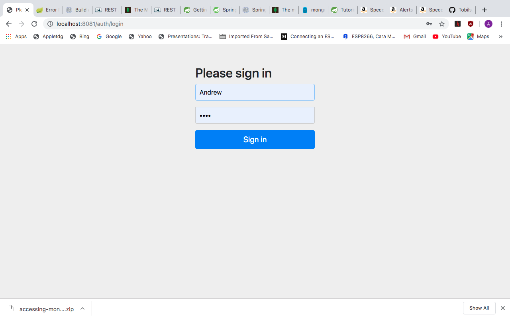

# OAUTH2 
## OAUTH 
[link](https://dzone.com/articles/build-an-oauth-20-authorization-server-with-spring)
* error disaat run untuk oauth2 securityConfiguration  
* solusi --> pastikan versinya sama versis saat menggunakan spring initializer

terdiri dari 2 project, yaitu :
1. oauth server
2. oauth client

## 1. OAUTH SERVER
teridiri dari 4 file yaitu :
1. AuthorizationServerApplication.java
   ```java
   package com.okta.spring.AuthorizationServerApplication;

   import org.springframework.boot.SpringApplication;
   import org.springframework.boot.autoconfigure.SpringBootApplication;
   import org.springframework.security.oauth2.config.annotation.web.configuration.EnableResourceServer;

   @SpringBootApplication
   @EnableResourceServer
   public class AuthorizationServerApplication {

      public static void main(String[] args) {
         SpringApplication.run(AuthorizationServerApplication.class,args);
      }
   }
   ```

2. AuthServerConfig.java
   ```java
   package com.okta.spring.AuthorizationServerApplication;
   //import org.springframework.beans.factory.annotation.Autowired;
   import org.springframework.beans.factory.annotation.Value;
   import org.springframework.context.annotation.Configuration;
   //import org.springframework.security.crypto.bcrypt.BCryptPasswordEncoder;
   import org.springframework.security.crypto.password.PasswordEncoder;
   import org.springframework.security.oauth2.config.annotation.configurers.ClientDetailsServiceConfigurer;
   import org.springframework.security.oauth2.config.annotation.web.configuration.AuthorizationServerConfigurerAdapter;
   import org.springframework.security.oauth2.config.annotation.web.configuration.EnableAuthorizationServer;
   import org.springframework.security.oauth2.config.annotation.web.configurers.AuthorizationServerSecurityConfigurer;

   @Configuration
   @EnableAuthorizationServer
   public class AuthServerConfig extends AuthorizationServerConfigurerAdapter {
      @Value("${user.oauth.clientId}")
      private String ClientID;
      @Value("${user.oauth.clientSecret}")
      private String ClientSecret;
      @Value("${user.oauth.redirectUris}")
      private String RedirectURLs;
      private final PasswordEncoder passwordEncoder;
      public AuthServerConfig(PasswordEncoder passwordEncoder) {
         this.passwordEncoder = passwordEncoder;
      }
      @Override
      public void configure(
               AuthorizationServerSecurityConfigurer oauthServer) throws Exception {
         oauthServer.tokenKeyAccess("permitAll()")
                  .checkTokenAccess("isAuthenticated()");
      }
      @Override
      public void configure(ClientDetailsServiceConfigurer clients) throws Exception {
         clients.inMemory()
                  .withClient(ClientID)
                  .secret(passwordEncoder.encode(ClientSecret))
                  .authorizedGrantTypes("authorization_code")
                  .scopes("user_info")
                  .autoApprove(true)
                  .redirectUris(RedirectURLs);
      }
   }
   ```
3. SecurityConfiguration.java
   ```java
   package com.okta.spring.AuthorizationServerApplication;
   import org.springframework.beans.factory.annotation.Value;
   import org.springframework.context.annotation.Bean;
   import org.springframework.context.annotation.Configuration;
   import org.springframework.core.annotation.Order;
   import org.springframework.security.config.annotation.authentication.builders.AuthenticationManagerBuilder;
   import org.springframework.security.config.annotation.web.builders.HttpSecurity;
   import org.springframework.security.config.annotation.web.configuration.WebSecurityConfigurerAdapter;
   import org.springframework.security.crypto.bcrypt.BCryptPasswordEncoder;
   @Configuration
   @Order(1)
   public class SecurityConfiguration extends WebSecurityConfigurerAdapter {
      @Value("${user.oauth.user.username}")
      private String username;
      @Value("${user.oauth.user.password}")
      private String password;
      @Override
      protected void configure(HttpSecurity http) throws Exception {
         http.requestMatchers()
                  .antMatchers("/login", "/oauth/authorize")
                  .and()
                  .authorizeRequests()
                  .anyRequest().authenticated()
                  .and()
                  .formLogin().permitAll();
      }
      @Override
      protected void configure(AuthenticationManagerBuilder auth) throws Exception {
         auth.inMemoryAuthentication()
                  .withUser(username)
                  .password(passwordEncoder().encode(password))
                  .roles("USER");
      }
      @Bean
      public BCryptPasswordEncoder passwordEncoder() {
         return new BCryptPasswordEncoder();
      }
   }
   ```
4. UserController.java
   ```java
   package com.okta.spring.AuthorizationServerApplication;
   import org.springframework.web.bind.annotation.GetMapping;
   import org.springframework.web.bind.annotation.RestController;
   import java.security.Principal;
   import org.slf4j.LoggerFactory;
   import org.slf4j.Logger;


   @RestController
   public class UserController {
      public static final Logger LOG = LoggerFactory.getLogger(UserController.class);
      @GetMapping("/user/me")
      public Principal user(Principal principal) {
         LOG.info("/user/me");
         LOG.info(principal.toString());
         return principal;
      }
   }
   ```

## cek /resources/application.properties
ubah file tsb menjadi :
```properties
server.port=8081
server.servlet.context-path=/auth
user.oauth.clientId=R2dpxQ3vPrtfgF72
user.oauth.clientSecret=fDw7Mpkk5czHNuSRtmhGmAGL42CaxQB9
user.oauth.redirectUris=http://localhost:8082/login/oauth2/code/
user.oauth.user.username=Andrew
user.oauth.user.password=abcd
```

## modify file build.granlde
```grandle
plugins {
	id 'org.springframework.boot' version '2.2.1.RELEASE'
	id 'io.spring.dependency-management' version '1.0.8.RELEASE'
	id 'java'
}

group = 'com.okta.spring'
version = '0.0.1-SNAPSHOT'
sourceCompatibility = '1.8'

repositories {
	mavenCentral()
}

dependencies {
	implementation 'org.glassfish.jaxb:jaxb-runtime'
	implementation 'org.springframework.security.oauth:spring-security-oauth2:2.3.3.RELEASE'
	implementation 'org.springframework.boot:spring-boot-starter-web'
	testImplementation('org.springframework.boot:spring-boot-starter-test') {
		exclude group: 'org.junit.vintage', module: 'junit-vintage-engine'
	}
}

test {
	useJUnitPlatform()
}
```

---
## OAUTH CLIENT
terdiri dari 3 file java, yaitu :
1. SecurityConfiguration.java
   ```java
   package com.okta.spring.SpringBootOAuthClient;
   import org.springframework.context.annotation.Configuration;
   import org.springframework.security.config.annotation.web.builders.HttpSecurity;
   import org.springframework.security.config.annotation.web.configuration.WebSecurityConfigurerAdapter;

   @Configuration
   public class SecurityConfiguration extends WebSecurityConfigurerAdapter {
      @Override
      public void configure(HttpSecurity http) throws Exception {
         http.antMatcher("/**").authorizeRequests()
                  .antMatchers("/","/login").permitAll()
                  .anyRequest().authenticated()
                  .and()
                  .oauth2Login();
      }
   }
   ```
2. SpringBootOAuthClientApplication.java
   ```java
   package com.okta.spring.SpringBootOAuthClient;
   import org.springframework.boot.SpringApplication;
   import org.springframework.boot.autoconfigure.SpringBootApplication;
   @SpringBootApplication
   public class SpringBootOAuthClientApplication {
      public static void main(String[] args) {
         SpringApplication.run(SpringBootOAuthClientApplication.class, args);
      }
   }
   ```
3. WebController.java
   ```java
   package com.okta.spring.SpringBootOAuthClient;
   import org.springframework.stereotype.Controller;
   import org.springframework.ui.Model;
   import org.springframework.web.bind.annotation.RequestMapping;
   import org.slf4j.Logger;
   import org.slf4j.LoggerFactory;

   import java.security.Principal;

   @Controller
   public class WebController {
      public static final Logger LOG = LoggerFactory.getLogger(WebController.class);
      @RequestMapping("/ecuredPage")
      public String securedpage(Model model, Principal principal)
      {
         LOG.info(">>>>>>>>>>>> secured Page");
         return "securedPage";
      }

      @RequestMapping("/")
      public String index(Model model, Principal principal)
      {
         LOG.info(">>>>>>>>>>>>>>>>> Index");
         return "index";
      }

      @RequestMapping("/errorPage")
      public String error(Model kodel, Principal principal)
      {
         LOG.info(">>>>>>>>>>> error page");
         return "error";
      }
   }
   ```
## setting
tambahkan 3 file untuk views :
1. index.html
   ```html
   <!DOCTYPE html>
   <html lang="en">
   <head>
      <meta charset="UTF-8">
      <title>Home</title>
   </head>
   <body>
      <h1>Spring Security SSO</h1>
      <a href="securedPage">login</a>
   </body>
   </html>
   ```
2. securedPage.html
   ```html
   <!DOCTYPE html>
   <html xmlns:th="http://www.thymleaf.org">
   <head>
      <meta charset="UTF-8">
      <title>Secured Page</title>
   </head>
   <body>
      <h1>Secured Page</h1>
      <span th:text="${#authentication.name}"></span>
   </body>
   </html>
   ```
3. error.html
   ```html
   <!DOCTYPE html>
   <html lang="en">
   <head>
      <meta charset="UTF-8">
      <title>Error Page</title>
   </head>
   <body>
      <h1> This is Error Page</h1>
   </body>
   </html>
   ```
* setting grandle
   ```grandle
   plugins {
      id 'org.springframework.boot' version '2.1.10.RELEASE'
      id 'io.spring.dependency-management' version '1.0.8.RELEASE'
      id 'java'
   }

   group = 'com.okta.spring'
   version = '0.0.1-SNAPSHOT'
   sourceCompatibility = '1.8'

   repositories {
      mavenCentral()
   }

   dependencies {
      implementation 'org.thymeleaf.extras:thymeleaf-extras-springsecurity5:3.0.4.RELEASE'
      implementation 'org.springframework.boot:spring-boot-starter-oauth2-client'
      implementation 'org.springframework.boot:spring-boot-starter-thymeleaf'
      implementation 'org.springframework.boot:spring-boot-starter-web'
      testImplementation 'org.springframework.boot:spring-boot-starter-test'
   }
   ```grandle

* ubah file application.properties menajdi application.yml
   ```yml
   server:
   port: 8082
   session:
      cookie:
         name: UISESSION
   spring:
   thymeleaf:
      cache: false
   security:
      oauth2:
         client:
         registration:
            custom-client:
               client-id: R2dpxQ3vPrtfgF72
               client-secret: fDw7Mpkk5czHNuSRtmhGmAGL42CaxQB9
               client-name: Auth Server
               scope: user_info
               provider: custom-provider
               redirect-uri-template: http://localhost:8082/login/oauth2/code/
               client-authentication-method: basic
               authorization-grant-type: authorization_code
         provider:
            custom-provider:
               token-uri: http://localhost:8081/auth/oauth/token
               authorization-uri: http://localhost:8081/auth/oauth/authorize
               user-info-uri: http://localhost:8081/auth/user/me
               user-name-attribute: name
   ```

## TEST RUNNING SOURCE CODE
* ./grandlew bootRun
* buka localhost:8082
* username --> Andrew
* password --> abcd

## OUTPUT


[<< back](../readme.md)